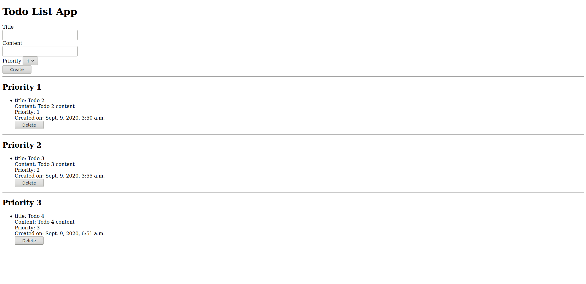

# Django Webinar - Build a Todo App with me!

## What the project looks like

## The Database

#### Only 1 Table (model or class in django) called Todo

| id  | title  | content        | created_at | priority |
| --- | ------ | -------------- | ---------- | -------- |
| 1   | Todo 1 | Todo 1 Content | Date time  | 1        |
| 2   | Todo 2 | Todo 2 Content | Date time  | 2        |
| 3   | Todo 3 | Todo 3 Content | Date time  | 3        |
| 4   | Todo 4 | Todo 4 Content | Date time  | 1        |

## Functionalities

- `GET` - fetches all tasks present in the database and displays them according to their priority field
- `ADD` - creates a new todo task and inserts it in the database
- `DELETE` - Removes a specific task from the database

## Steps to replicate this project

1. Virtual environment - https://docs.python.org/3/library/venv.html
2. Install sqlite3 - https://www.servermania.com/kb/articles/install-sqlite/
3. Create a virtual environment - `python3 -m venv /path/to/new/virtual/environment`
4. Activate it
   - In Terminal - `source <venv>/bin/activate`
   - In cmd.exe - `<venv>\Scripts\activate.bat`
5. To avoid all future installations, you can run `pip3 install -r requirements.txt` after cloning the repository to get a virtual environment identical to mine
6. Install Django via pip. Run command `pip3 install django` or `pip install django==<major>.<minor>.<patch>`
7. To Start project, run `django-admin startproject <project-name>`
8. `cd <project-name>` and then run `python3 manage.py runserver` and have a look at the basic welcome screen
9. Create app todos - `python3 manage.py startapp todos`
10. Install app in settings.py and add routing to app in urls.py
11. Basic hello world Http response view in todos app
12. Add Urls in app
13. Hello world test
14. Create super user - `python3 manage.py createsuperuser`
15. Create models
16. make migrations - `python3 manage.py makemigrations`
17. migrate - `python3 manage.py migrate`
18. Register model
19. Django admin tour
20. Python shell DB tour - `python3 manage.py shell`
21. Create template to get the data and show todos, render template in views.py
22. Create/delete todos and show changes
23. Create add todo form in template
24. make add function in views.py
25. Change urls.py
26. Show add functionality and database changes
27. Create delete todo form in template
28. make delete function in views.py
29. Change urls.py
30. Show delete functionality and db changes
31. Create Priority lists in templates
32. Add CSS

For the Webinar:
<project-name> = todolist
<app-name> = todos
